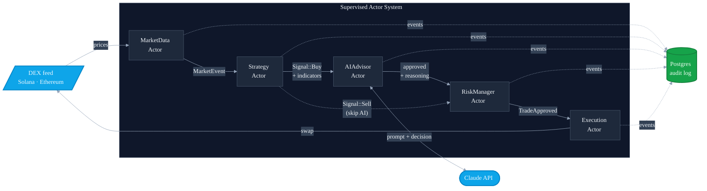
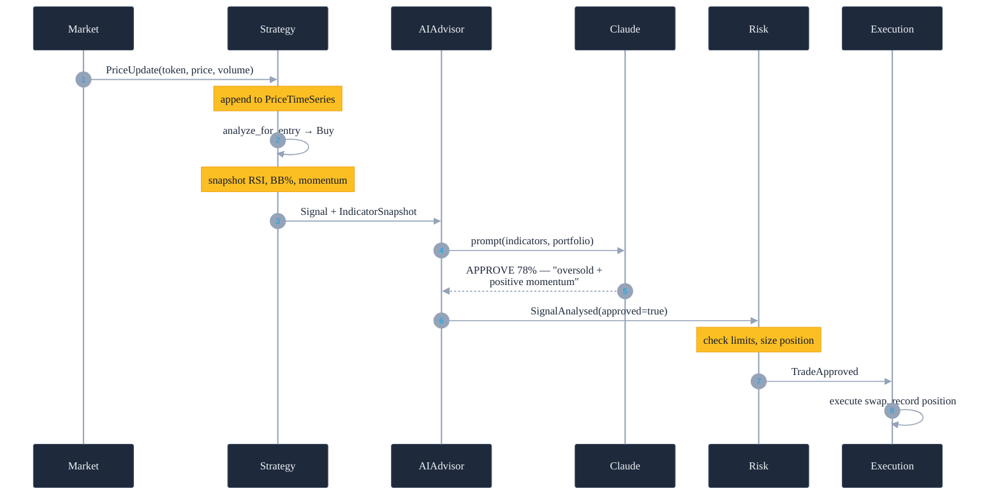

# Mantis

[](https://github.com/mitsuaki-u/mantis/actions/workflows/ci.yml)
[](LICENSE)
[](https://www.rust-lang.org)
[](#testing-and-ci)
[](#testing-and-ci)

A Rust trading framework with trait-based customizable strategies and DEX backends, a supervised actor architecture, and an LLM advisor that audits every trade decision.

> **31,000 lines of Rust** · **151 unit tests** · **0 clippy warnings** · **~$0.001 per AI signal** · **<500ms AI latency**

```
   AIAdvisor analysing BUY for JUPyiwrYJF (RSI=21.8)
   AI REJECTED JUPyiwrYJF (85%) — RSI at 21.8 is excessively oversold
   (potential trap), momentum score of 3.40 is weak, and -7.5% decline
   lacks reversal confirmation; wait for RSI recovery above 30 or volume
   surge before entry.
```

Mantis sends every BUY through Claude before executing. The reasoning is stored with the trade and printed in the logs.

## Why this exists

This is a portfolio project. The interesting bits:

1. **Chain-agnostic core, multiple DEX backends.** The strategy, risk, and indicator layers don't know which chain they're on. Ethereum (Uniswap V3 live + paper) and Solana (DexScreener, paper only) plug in behind the same trait. 

2. **Supervised actors over a single futures pipeline.** Concurrent scanning, strategy evaluation, AI review, risk enforcement, and execution each run as isolated actors over a typed event bus. A supervisor watches them and can recover individual actors without restarting the process.

3. **LLM as a structured second opinion.** The AI advisor receives indicator values, portfolio state, and returns a parseable APPROVE/REJECT with confidence and one-sentence reasoning. Prompt caching keeps each call ~$0.001. 

## Architecture



A `SupervisorActor` watches every actor for liveness and can restart them independently. An `EventRouter` does typed pub/sub, so actors never call each other directly. Every interaction is a typed event flowing through the bus. The database listens to all event types for audit and persistence.

SELL signals (stop-loss, take-profit, trailing stop) bypass the AI advisor and go straight to risk, so exits never wait on an external API.

### Signal flow on a BUY decision



Every signal carries a UUID `correlation_id` so a single trade can be traced through Strategy → AIAdvisor → Risk → Execution → Database.

## Quick start (paper mode)

```bash
# Build
cargo build --release

# Postgres (one-time)
psql postgres -c "CREATE ROLE mantis WITH LOGIN;"
psql postgres -c "CREATE DATABASE mantis OWNER mantis;"

# Configure (Solana paper trading + AI advisor)
./target/release/mantis config set solana.rpc_url https://mainnet.helius-rpc.com/?api-key=YOUR_KEY
./target/release/mantis config set anthropic_api_key sk-ant-api03-...

# Run
./target/release/mantis trading start --strategy momentum --interval 15 --indicator-profile scalping
```

In a separate terminal:

```bash
./target/release/mantis trading status
./target/release/mantis trading positions
./target/release/mantis trading history
./target/release/mantis trading stop
```

The `anthropic_api_key` can also come from the `ANTHROPIC_API_KEY` environment variable (config takes precedence). Without an Anthropic key the bot still runs, the AI advisor logs a warning at startup and signals pass through unmodified.

## Configuration

Default config location:

- macOS: `~/Library/Application Support/mantis/config.json`
- Linux: `~/.config/mantis/config.json`

```bash
mantis config show
mantis config path
```

Full reference: see [CONFIGURATION.md](CONFIGURATION.md). Architecture detail: see [docs/architecture.md](docs/architecture.md).

## Strategies are a trait

`TradingStrategy` is the interface; `MomentumStrategy` and `RsiStrategy` are example implementations. Adding a new strategy is one file:

```rust
pub trait TradingStrategy: fmt::Display + Send + Sync + 'static {
    fn name(&self) -> &str;
    fn analyze_for_entry(&self, token: &TokenMetrics) -> bool;
    fn analyze_for_exit(&self, token: &TokenMetrics, position: Option<&Position>,
                        risk_params: Option<(f64, f64)>) -> Option<ExitReason>;
    fn indicator_profile(&self) -> IndicatorProfile;
    fn indicator_weights(&self) -> IndicatorWeights { /* default */ }
    fn price_series_for(&self, token_id: &str) -> Option<PriceTimeSeries>;
    /* ... cooldown, min volume, stop-loss accessors ... */
}
```

Implement those methods, register the new variant in the factory, and the rest of the pipeline picks it up automatically. The actor layer doesn't know which strategy is running, it operates on the trait. 

### Why have strategies at all when an LLM could just look at the data?

Cost. A market scan polls ~150 tokens every 15s, which is tens of thousands of evaluations per hour. RSI runs in microseconds and is free. An LLM call is ~$0.001 and ~500ms. Routing every tick through Claude would cost hundreds of dollars per day for the same job. Strategies act as a deterministic, microsecond-latency pre-filter. The LLM is invoked only on the small fraction of signals worth a second opinion, keeping API costs at ~$1/day.

Strategy gates filter for what matters; the AI adds context the indicators alone don't capture.

## AI Advisor

Sits between the strategy layer and the risk layer. On every BUY signal it asks Claude for an APPROVE or REJECT given the indicators and portfolio state, then attaches the reasoning to the decision event.

### What Claude sees on each signal

```
TOKEN: BONK (DezXAZ8z)
SIGNAL: BUY
STRATEGY: Momentum

TECHNICAL INDICATORS:
- RSI: 27.3 (oversold)
- Bollinger position: 12% of band
- Momentum score: 42.18
- 24h price change: +3.4%
- Price: $0.000012
- 24h volume: $4200000

PORTFOLIO STATE:
- Open positions: 0/5
- Daily P&L: +0.0%
```

### What Claude returns

```
DECISION: APPROVE
CONFIDENCE: 78
REASONING: RSI oversold at 27 with positive momentum and bullish 24h
  trend supports entry with full portfolio headroom.
```

### Implementation details

- Model: `claude-haiku-4-5-20251001` (fastest and cheapest tier)
- Prompt caching on the static system prompt cuts input cost ~90%
- Indicator values come from a snapshot taken at signal-publication time using the strategy's own time series, so Claude sees the same numbers the strategy used to decide
- Cost: ~$0.001 per signal
- Latency: ~500ms typical, 3s timeout, fails open with confidence 50 if Claude is unreachable
- Response parsing handles formatting variations: lowercase keywords, missing fields, malformed responses. See `src/infrastructure/ai/claude.rs::parse_decision`.

## Strategies and risk

### Strategies

These following example implementations are meant to demonstrate the framework, not vetted trading algorithms, use at your own risk.

- **Momentum**: composite score over RSI, MACD, Bollinger Bands, and volume trend; configurable weights per indicator
- **RSI**: oversold/overbought entries and exits with configurable thresholds

Both strategies share an `IndicatorProfile` (Scalping, DayTrading, SwingTrading, Standard) that sets the periods used for each indicator. Strategy logic is independent of chain.


### Risk management

- Stop-loss, take-profit, trailing stop
- Per-position and portfolio-level exposure limits
- Volatility filter, max drawdown, daily loss halt
- Gas/fee protection (absolute USD floor + percentage-of-trade ceiling)
- On-chain price validation before live execution

## Testing and CI

- **151 unit tests** across strategies, indicators, risk assessment, financial calculations, validation, and AI response parsing
- CI pipeline (`.github/workflows/ci.yml`) enforces:
  - `cargo fmt --check`
  - `cargo clippy --all-targets -- -D warnings`
  - `cargo test --lib`
- Coverage focuses on pure-logic core modules. 

### Indicator profiles

| Profile | Scan interval | Warmup | Use case |
|---|---|---|---|
| `scalping` | 5–30s | ~30 candles | High-frequency entries |
| `day_trading` | 60s | ~50 candles | Default |
| `swing_trading` | 120s | ~57 candles | Position trading |
| `standard` | 300s+ | ~71 candles | Traditional TA |

### Logging

```bash
RUST_LOG=mantis=info,tokio_postgres=warn ./target/release/mantis trading start
```

Logs are structured JSON. The bot prints these key event lines on every BUY signal:

```
  Generated BUY signal for X
  Signal indicators for X: RSI=..., BB%=..., Momentum=...
  AIAdvisor analysing BUY for X (RSI=...)
  AI APPROVED X (78%) — ...   (or)    AI REJECTED X (40%) — ...
```

## Live trading (Ethereum)

> ⚠️ Use a dedicated wallet funded with only what you're willing to lose. Never your main wallet.

Currently only Ethereum has a live execution path (Uniswap V3 swaps). Solana live execution via Jupiter is on the roadmap; paper mode is the recommended default for Solana today.

```bash
export MANTIS_PRIVATE_KEY=0xYOUR_PRIVATE_KEY
mantis config set dex.wallet.private_key_env MANTIS_PRIVATE_KEY
mantis config set trading.max_positions 1
mantis config set trading.max_position_size 50.0
MANTIS_PRIVATE_KEY=0x... mantis trading start --live
```

The wallet needs ~0.1 ETH for gas. The bot wraps ETH→WETH automatically before each buy.

## Roadmap

What's not implemented yet, in rough priority order:

- **Solana live execution** via Jupiter swap API (paper mode works today)
- **Web dashboard** for visualising AI decisions and trade history
- **Additional strategies** beyond momentum and RSI
- **Actor integration tests** to complement the existing unit tests

## License

MIT. See [LICENSE](LICENSE).

## Disclaimer

This software is provided for educational purposes. You are solely responsible for any funds used with this software.
